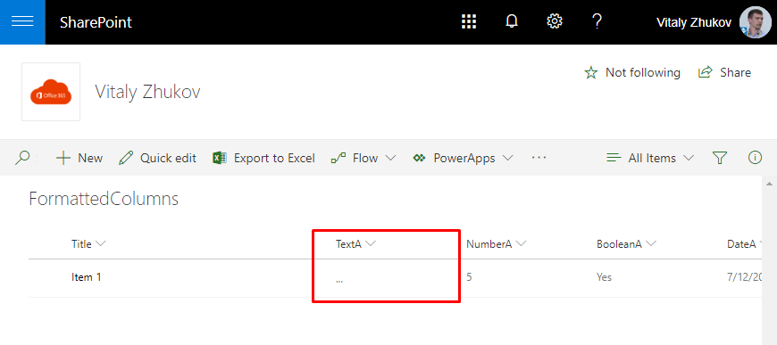
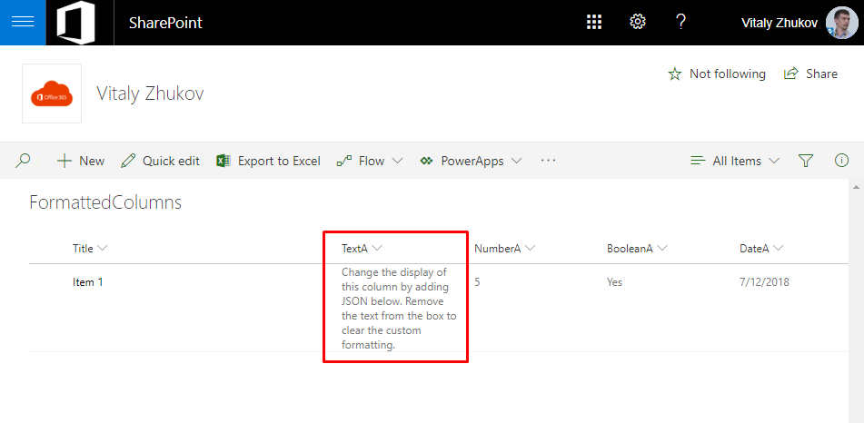
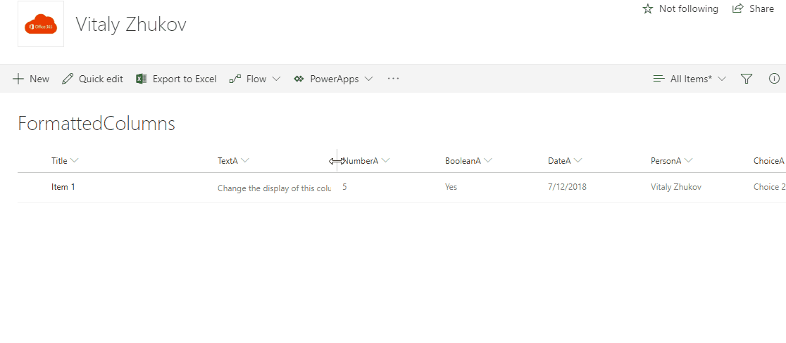
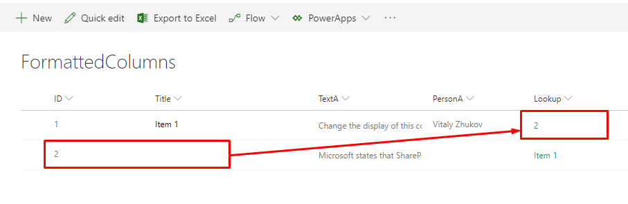
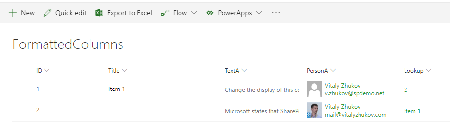
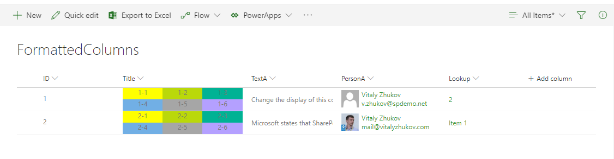

# SharePoint Column Formatting. Samples

## Sample #1. Hide value on small screen
### JSON: [1-screen-size.json](1-screen-size.json)
### Result:

## Sample #2. Show values in one line
### JSON: [2-value-in-one-line.json](2-value-in-one-line.json)
### Result:

## Sample #3. Show lookup id if lookup value is empty
### JSON: [3-lookup-id-instead-of-value.json](3-lookup-id-instead-of-value.json)
### Result:

## Sample #4. Show user picture
### JSON: [4-user-picture.json](4-user-picture.json)
### Result:

## Sample #5. Split cell
### JSON: [5-split-cell.json](5-split-cell.json)
### Result:

## Post
These samples described in my post here: [SharePoint Online. Column JSON formatting](http://blog.vitalyzhukov.ru/en/sharepoint-online-column-json-formatting)
